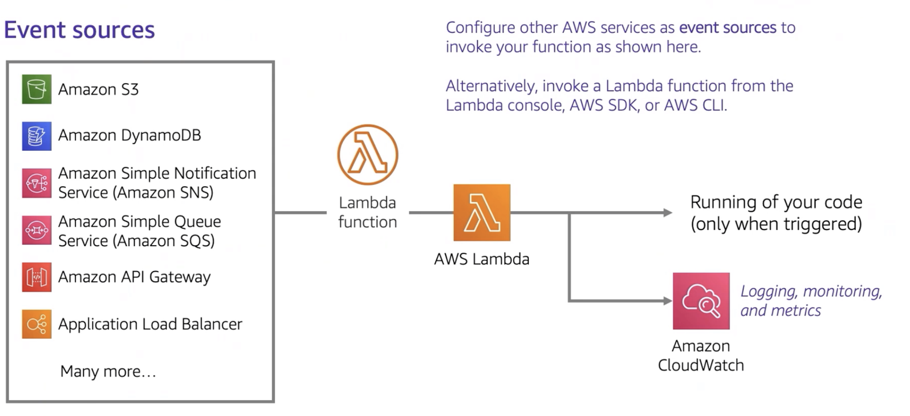
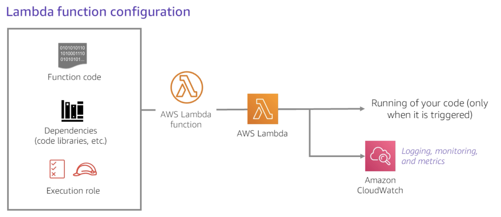
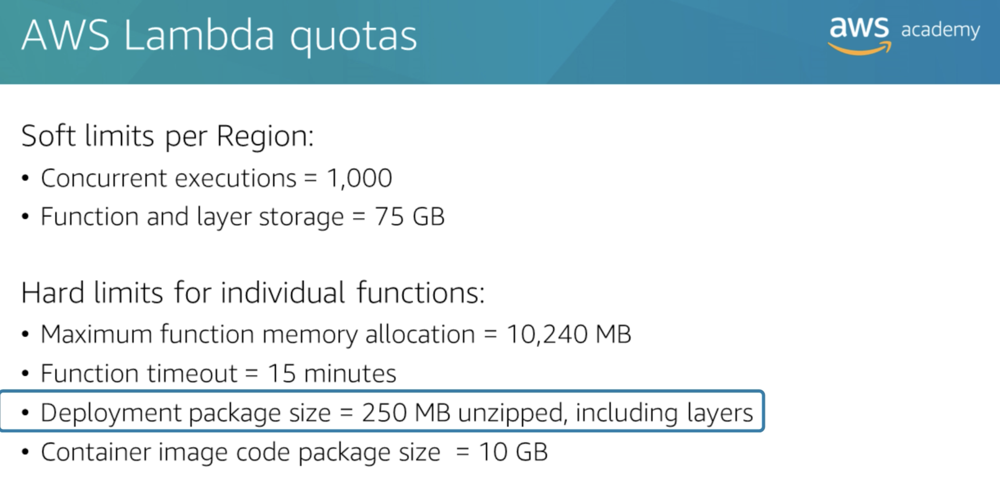

AWS Lambda is a serverless compute service.

Publish events from other services to AWS Lambda and execute code in response to them.

Supports multiple languages like Node.js, Python, Ruby, Java, Go, .NET Core, and custom runtime.

