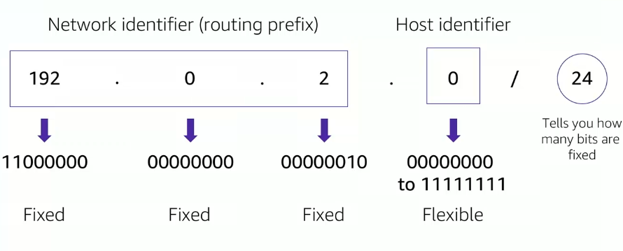

IPv4 address is of 32 bits. 

##### IPv6

IPv6 address is of 128 bits, having 8 groups of 4 hexadecimal digits separated by colons. 
 

#### CIDR (Classless Inter-Domain Routing)

For every CIDR IP address, AWS reserves 5 IP addresses.

 

#### OSI Model

1. Physical Layer : Physical connection between devices. (Ethernet, Wi-Fi)
2. Data Link Layer : Data transfer between devices. (Ethernet, Wi-Fi)
3. Network Layer : Routing of data. (IP, ICMP, ARP)
4. Transport Layer : End-to-end communication. (TCP, UDP)
5. Session Layer : Establishes, maintains and terminates connections. (SMB, NetBIOS)
6. Presentation Layer : Data translation. (ASCII, EBCDIC)
7. Application Layer : User interface. (HTTP, FTP, SMTP)

### Public IPv4 address and Elastic IP address

Automatically assigned to your instance when you launch it. It is reachable from the internet.
Whereas Elastic IP address is static IPv4 address designed for dynamic cloud computing. It is reachable from the internet.
