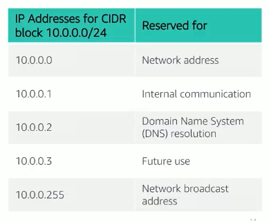
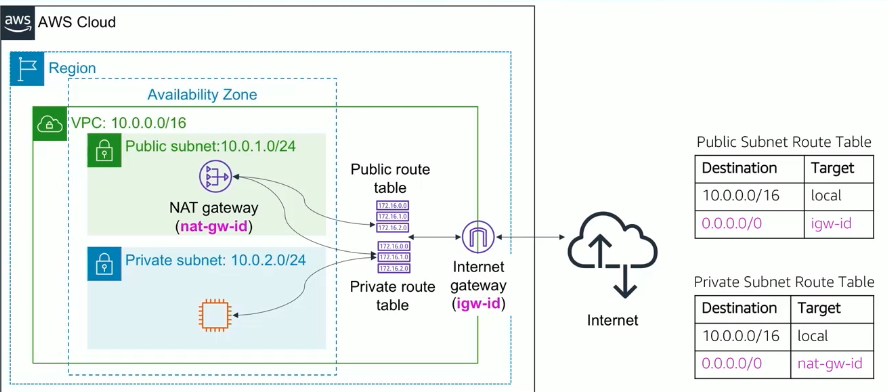

VPC (Virtual Private Cloud)

subnets belongs to single availability zone. It is the subnet for the VPC.

The largest IPv4 CIDR block you can assign to a VPC is /16. The smallest is /28.

### Route Table

- Each row in the table is called a route. The route table contains a destination and a target. The destination is the range of IP addresses, and the target is the next hop. The target can be a gateway, a network interface, or a peering connection.
  Note: You cannot delete local route entry, that is used for internal communication.

- Each subnet in the VPC must be associated with a route table.

### Workflows

Elastic IP -> VPC -> NAT Gateway -> Internet Gateway -> Internet

NAT Gateway: Provides internet access to instances in private subnets while blocking inbound connections from the internet.
Internet Gateway: Allows instances in public subnets to communicate with the internet, supporting both outbound and inbound connections.

Internet Gateway does two things :

- It provides a target in your VPC route table for internet-routable traffic.
- It performs network address translation (NAT) for instances that have been assigned public IPv4 addresses.

### VPC Peering

VPC peering allows you to connect one VPC with another via a direct network route using private IP addresses. Instances in either VPC can communicate with each other as if they are within the same network.
VPC Peering can be done between VPCs in the same region or different regions with same aws account or different accounts.

But it has some restrictions:

- You cannot create a VPC peering connection between VPCs that have matching or overlapping CIDR blocks.

### Security Groups

You can think this as a firewall for your instances. It controls inbound and outbound traffic for your instances.

